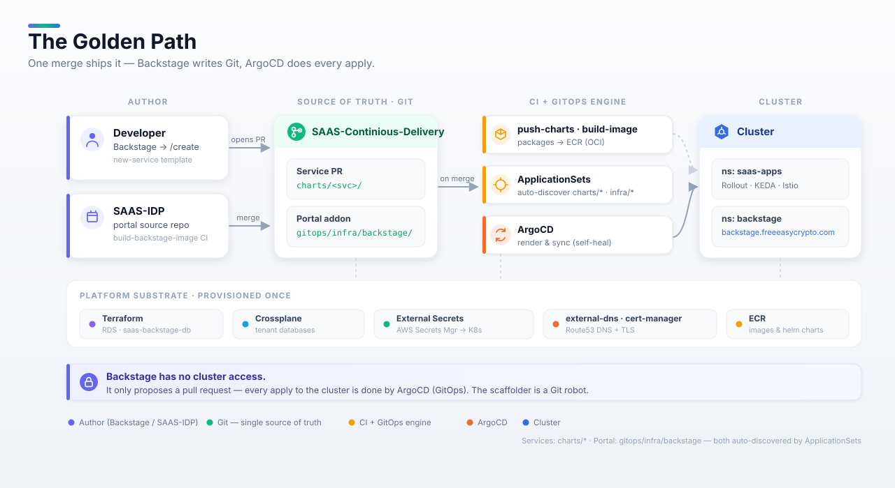

# SaaS Developer Portal (Backstage)

An internal developer portal (IDP) for the SaaS platform. It surfaces the service
catalog, live Kubernetes health, Argo CD sync status, TechDocs and self-service
scaffolder templates, with sign-in via **Keycloak** OIDC (guest auth in local dev).

Backstage version: **1.54.0** (new backend system). Node 20/22, Yarn 4.

## The golden path

A developer scaffolds a service (or the portal ships itself) with a single merge —
Backstage only writes Git, and ArgoCD does every apply.



## Layout

| Concern | Location |
|---|---|
| App source | this repo — a Backstage monorepo (`packages/backend` + `packages/app`) |
| Local config | `app-config.yaml` |
| Prod overlay | `app-config.production.yaml` (Postgres, in-cluster K8s, Keycloak OIDC, GitHub org discovery) |
| Seed catalog | `catalog/all.yaml` — platform-level entities (team, systems, CD repo, portal) |
| Scaffolder templates | `catalog/templates/*` |
| Container image | `Dockerfile` (official host-build packaging) |

The **per-service** catalog entities live in each microservice repo's own
`catalog-info.yaml`, ingested by GitHub org discovery (`app-config.production.yaml`).

## Run locally

```bash
yarn install
yarn dev
```

Portal at http://localhost:3000, backend at http://localhost:7007. Local dev uses
an in-memory SQLite DB, guest sign-in, and no external integrations required
(set `GITHUB_TOKEN` / `BACKEND_SECRET` to exercise GitHub + auth).

## Scaffolder templates

| Template | What it does |
|---|---|
| `new-service` | Scaffolds a `charts/<name>/` Helm chart + `catalog-info.yaml`, PRs to `saas-continious-delivery`. |
| `request-database` | Generates a Crossplane `AppDatabase` claim (the `xappdatabases` XRD), PRs to `saas-continious-delivery`. |
| `register-existing` | Registers an existing repo's `catalog-info.yaml` into the catalog. |

### Why templates render (the gotcha)

Templates only appear under **/create** because of two things working together:

1. The backend loads **`@backstage/plugin-catalog-backend-module-scaffolder-entity-model`**
   (`packages/backend/src/index.ts`) — this is what teaches the catalog to process
   the `kind: Template` entity. Without it, templates are silently ignored.
2. Each template gets its **own** `catalog.locations` entry with `rules: [allow: [Template]]`
   in `app-config.yaml`. The `catalog/all.yaml` location deliberately does *not*
   allow `Template`, and static file locations do **not** expand globs — so every
   new template needs its own explicit location entry.

Add a new template → add both the file **and** a location entry, or it won't show up.

## Production

- **Auth:** Keycloak OIDC. Set `KEYCLOAK_METADATA_URL`, `KEYCLOAK_CLIENT_ID`,
  `KEYCLOAK_CLIENT_SECRET` (synced via ESO into the `backstage-oidc` secret).
- **DB:** Postgres via `POSTGRES_*`.
- **Kubernetes:** in-cluster ServiceAccount token + a `backstage-read` ClusterRole.
- **Argo CD:** `ARGOCD_URL` + `ARGOCD_AUTH_TOKEN` (instance name `saas`).
- **Host:** `BACKSTAGE_HOST`.
- **Discovery:** GitHub org `huzaifa678`, ingesting each repo's `catalog-info.yaml`.

Deploy this repo's image via the `saas-continious-delivery` ArgoCD (add it as an
addon Application pointing at a Backstage Helm chart / manifests).
